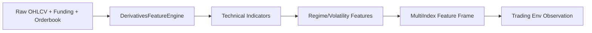

# Quant AI Trading System

A multi‑asset **perpetual futures** trading system built around **PPO (Stable‑Baselines3)**, a custom **institutional‑style trading environment**, and a technical‑feature pipeline for crypto markets (BTC/ETH/SOL). The system supports **backtesting**, **paper trading (live or replay)**, and **fine‑tuning** on newer data.

> **Scope note:** The current running pipeline is **market data + technical features**. Sentiment/on‑chain modules exist in docs but are **not wired into training or realtime** in this repository.

---

## System Architecture (High Level)

```mermaid
graph TD
    A[Market Data (CCXT or Cached Parquet)] --> B[Feature Engineering]
    B --> C[Institutional Env (Perp Futures)]
    C --> D[PPO Policy]
    D --> E[Risk Engine]
    E --> C
    C --> F[Paper Trading / Backtest]
```

---

## Data & Feature Pipeline


```mermaid
graph LR
    A[Raw OHLCV + Funding + Orderbook] --> B[DerivativesFeatureEngine]
    B --> C[Technical Indicators]
    C --> D[Regime/Volatility Features]
    D --> E[MultiIndex Feature Frame]
    E --> F[Trading Env Observation]
```

- Data comes from **Binance perpetuals** via CCXT or cached parquet in `data/`.
- Training timeframe: **5m** (config: `data.timeframe`).
- Realtime uses **1m** polling but resamples to **5m** for consistency.

---

## Models & Why

### PPO (Stable‑Baselines3)
**Why PPO?**
- Works well with **continuous action spaces** (position sizing).
- Stable updates (clipped objective).
- Strong baseline for non‑stationary environments like markets.

### Feature Extractor (Actual)
**Used in this repo:** `HybridFeatureExtractor` (in `main_opt.py`)
- Combines **ResNet‑style MLP blocks** + **Transformer encoder**.
- Designed to capture both **pattern recognition** and **temporal dependencies**.

---

## Trading Environment

- **Environment:** `trading_env/institutional_perp_env.py`
- **Action space:** continuous, shape `(n_assets,)`
- **Observations:** technical + regime features + portfolio state
- **Risk engine:** `risk_management/risk_engine.py`

Risk controls include:
- Max drawdown limits
- Leverage caps
- Position concentration
- VaR / volatility controls

---

## Realtime Paper Trading

### Live (5m model, 1m polling)
```bash
MPLCONFIGDIR=/tmp venv312/bin/python start_realtime_trading.py \
  --data-source live \
  --model-mode sb3 \
  --poll-interval 10 \
  --metrics-interval 30 \
  --disable-reports
```

### Replay
```bash
MPLCONFIGDIR=/tmp venv312/bin/python start_realtime_trading.py \
  --data-source replay \
  --replay-start 2021-01-01 \
  --replay-end 2021-01-07 \
  --replay-speed 0.5 \
  --model-mode sb3 \
  --disable-reports
```

**Realtime logs are minimal** (by design):
- `TRADE ...`
- `PORTFOLIO ...`
- `POSITIONS ...`
- `METRICS ...` (rolling window)

---

## Strategy Presets (5 scenarios)
Configs live in `config/strategies/`:

- `fortress_100k.yaml` — conservative
- `core_100k.yaml` — balanced baseline
- `momentum_50k.yaml` — higher risk
- `aggressive_25k.yaml` — stress test
- `capital_preserve_250k.yaml` — large‑account low‑volatility

Run one like this:
```bash
MPLCONFIGDIR=/tmp venv312/bin/python start_realtime_trading.py \
  --config config/strategies/core_100k.yaml \
  --data-source live \
  --model-mode sb3 \
  --poll-interval 10 \
  --metrics-interval 30 \
  --disable-reports
```

---

## Backtesting
```bash
MPLCONFIGDIR=/tmp venv312/bin/python backtesting/run_backtest.py \
  --model-path models/manual/phase6/phase6_model.zip \
  --start-date 2021-01-01 \
  --end-date 2021-02-01 \
  --no-visualizations \
  --no-env-check
```

Results are saved to `results/backtest/`.

---

## Fine‑Tuning (Continue Training)
Fine‑tuning updates weights on newer data without full retrain.

Example (Apr 2025 → Feb 2026, 200k steps):
```bash
MPLCONFIGDIR=/tmp venv312/bin/python main_opt.py \
  --continue-training \
  --model-path models/manual/phase6/phase6_model.zip \
  --env-path models/manual/phase6/vec_normalize.pkl \
  --additional-steps 200000 \
  --start-date 2025-04-01 \
  --end-date 2026-02-04 \
  --no-wandb \
  --gpus 1
```

---

## Config & Defaults
Main config: `config/prod_config.yaml`

Key settings:
- `trading.initial_balance`
- `trading.max_leverage`
- `risk_management.limits.*`
- `data.timeframe` (5m)

CLI arguments override config **only if passed**.

---

## Project Structure
```
quan/
├── main_opt.py                     # Training / fine‑tuning
├── start_realtime_trading.py       # Realtime launcher
├── realtime_trading.py             # Live/replay engine
├── trading_env/                    # Institutional env
├── data_system/                    # Data + feature engine
├── risk_management/                # Risk engine
├── backtesting/                    # Institutional backtester
├── config/                         # Base config + strategy presets
└── models/                         # Trained models
```

---

## Disclaimer
This software is for educational purposes only. Do not risk money you are afraid to lose. USE AT YOUR OWN RISK.
