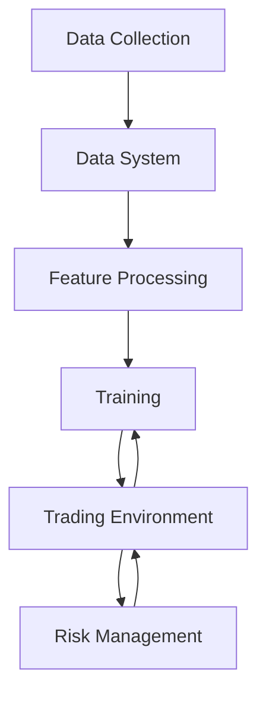

# Quant AI Trading System

<!-- ./scripts/manual_incremental.sh init 500000 --training-mode --drive-ids-file drive_file_ids.json  -->

A sophisticated AI-powered perpetual futures trading system that utilizes multiple data sources and advanced machine learning techniques to make trading decisions across multiple cryptocurrencies. The system employs a hierarchical reinforcement learning approach with attention mechanisms to process various types of data and generate trading signals.

## Trading Strategies

### 1. Multi-Modal Market Analysis

The system combines multiple data sources to form a comprehensive market view:

#### Technical Analysis

- **Trend Analysis**: Uses transformers to process price action and identify trends across multiple timeframes
- **Momentum Indicators**: RSI, MACD, and Bollinger Bands with adaptive thresholds
- **Volume Analysis**: Volume-weighted metrics for trade confirmation
- **Cross-Asset Correlations**: Analyzes relationships between different cryptocurrencies

#### Sentiment Analysis (Planned)

- **News Impact**: Processes news articles using RoBERTa for sentiment scoring
- **Social Media**: Analyzes Twitter and other social media platforms for market sentiment
- **Market Psychology**: Measures fear/greed through various indicators

#### On-Chain Analysis (Planned)

- **Whale Tracking**: Monitors large wallet movements
- **Network Health**: Analyzes transaction volumes, active addresses, and network growth
- **Smart Contract Activity**: Monitors DeFi and other protocol usage

### 2. Risk Management

- **Dynamic Position Sizing**: Adjusts position sizes based on:
  - Market volatility
  - Account equity
  - Cross-asset correlation risk
  - Current market regime
- **Stop Loss Strategies**:
  - Volatility-adjusted stops
  - Time-based stops
  - Profit protection mechanisms

### 3. Execution Strategy

- **Smart Order Routing**:
  - Minimizes market impact
  - Considers liquidity pools
  - Adapts to market microstructure
- **Entry/Exit Optimization**:
  - Uses TWAP/VWAP for large orders
  - Implements iceberg orders when needed
  - Considers funding rates for perpetual futures

# Quantitative Trading System Workflow

## System Architecture Diagram



## 1. Data Collection Layer

The data collection layer is responsible for gathering multi-modal data from various sources:

- Market data (prices, volumes, order book)
- Sentiment data (social media, news)
- On-chain data (whale movements, network metrics)

Key components:

- `collect_multimodal.py`: Coordinates collection of data from different sources
- `whale_tracker.py`: Monitors large wallet movements and blockchain activity
- `test_apis.py`: Tests API connections and data validity

## 2. Data System Layer

The data system processes and manages the collected data:

### Data Management

- `data_manager.py`: Core data processing and storage
- `enhanced_data_manager.py`: Advanced data processing features
- `multimodal_feature_extractor.py`: Extracts features from different data types

### Feature Processing

- `feature_extractors.py`: Contains various feature extraction methods
  - Market features (price, volume, volatility)
  - Sentiment features (sentiment scores, social metrics)
  - On-chain features (network activity, whale movements)

## 3. Training Layer

The training system uses hierarchical reinforcement learning:

### Hierarchical PPO Implementation

- `hierarchical_ppo.py`: Implements hierarchical proximal policy optimization
  - High-level policy: Strategic decisions
  - Low-level policy: Tactical execution
  - Reward shaping based on PnL and risk metrics

## 4. Trading Environment

The institutional perpetual futures trading environment:

### Key Components (`institutional_perp_env.py`):

- Observation Space:

  ```python
  # Market, sentiment, onchain, and portfolio features
  self.observation_space = spaces.Box(
      low=-np.inf,
      high=np.inf,
      shape=(total_features,),
      dtype=np.float32
  )
  ```

- Action Space:
  ```python
  # Trade decisions (-1 to 1) and position sizes (0 to 1)
  self.action_space = spaces.Box(
      low=np.array([-1] * n_assets + [0] * n_assets),
      high=np.array([1] * n_assets + [1] * n_assets),
      dtype=np.float32
  )
  ```

### Key Methods:

1. Trade Execution:

```python
def _execute_trade(self, asset: str, trade_decision: float, position_size: float):
    # Calculates target position
    # Handles transaction costs
    # Updates positions and balance
```

2. Risk-Adjusted Rewards:

```python
def _calculate_risk_adjusted_reward(self, risk_metrics: Dict):
    # Incorporates multiple risk factors:
    # - Sharpe ratio
    # - Sortino ratio
    # - Calmar ratio
    # - Diversification score
    # - Leverage penalty
```

## 5. Risk Management Layer

Comprehensive risk management system:

### Risk Engine (`risk_engine.py`):

- Risk Limits:
  - Maximum drawdown
  - Leverage limits
  - VaR limits
  - Position concentration
  - Correlation limits
  - Liquidity ratios

### Key Risk Functions:

1. Portfolio Risk Calculation:

```python
def calculate_portfolio_risk(self, positions, market_data, portfolio_value):
    # Calculates VaR
    # Measures Expected Shortfall
    # Monitors position concentration
    # Tracks correlation risk
```

2. Liquidation Risk:

```python
def check_risk_limits(self, risk_metrics):
    # Verifies all risk limits
    # Returns violations if any
    # Triggers liquidation if necessary
```

## System Workflow

1. **Data Pipeline**:

   - Continuous data collection from multiple sources
   - Feature extraction and preprocessing
   - Data storage and management

2. **Training Process**:

   - Hierarchical PPO training with two policy levels
   - Risk-aware reward shaping
   - Continuous model updates based on performance

3. **Trading Execution**:

   - Environment state observation
   - Policy-based action selection
   - Smart order execution with transaction cost consideration
   - Real-time risk monitoring and management

4. **Risk Management**:
   - Continuous risk metric calculation
   - Limit monitoring and enforcement
   - Automated risk-based position adjustment
   - Liquidation protection

## Key Features

1. **Multi-modal Data Integration**:

   - Market data analysis
   - Sentiment incorporation
   - On-chain metrics utilization

2. **Advanced Risk Management**:

   - Real-time risk monitoring
   - Multiple risk metric tracking
   - Automated risk limit enforcement

3. **Smart Execution**:

   - Transaction cost optimization
   - Price impact consideration
   - Liquidity-aware trading

4. **Hierarchical Learning**:
   - Strategic high-level decisions
   - Tactical execution optimization
   - Risk-adjusted reward optimization

## Future Enhancements

1. Integration of news and social media sentiment analysis
2. On-chain data integration
3. Enhanced risk management features
4. Multi-exchange support
5. Advanced order execution strategies

## License

This project is licensed under the MIT License - see the LICENSE file for details.

## Disclaimer

This software is for educational purposes only. Do not risk money which you are afraid to lose. USE THE SOFTWARE AT YOUR OWN RISK. THE AUTHORS AND ALL AFFILIATES ASSUME NO RESPONSIBILITY FOR YOUR TRADING RESULTS.

## Institutional Backtesting Module

A new institutional-grade backtesting module has been added to the repository. This module provides comprehensive backtesting capabilities with a focus on eliminating bias, analyzing market regimes, and providing detailed performance metrics.

### Features

- **Robust Backtesting**: Evaluate trading models with proper observation and reward normalization
- **Market Regime Analysis**: Identify and analyze performance across different market regimes
- **Walk-Forward Validation**: Test model robustness across multiple time windows
- **Comprehensive Metrics**: Calculate performance metrics, risk metrics, and trade statistics
- **Visualization Tools**: Create visualizations of performance, drawdowns, returns distribution, and more
- **Bias Reduction**: Techniques to minimize look-ahead bias and data leakage


