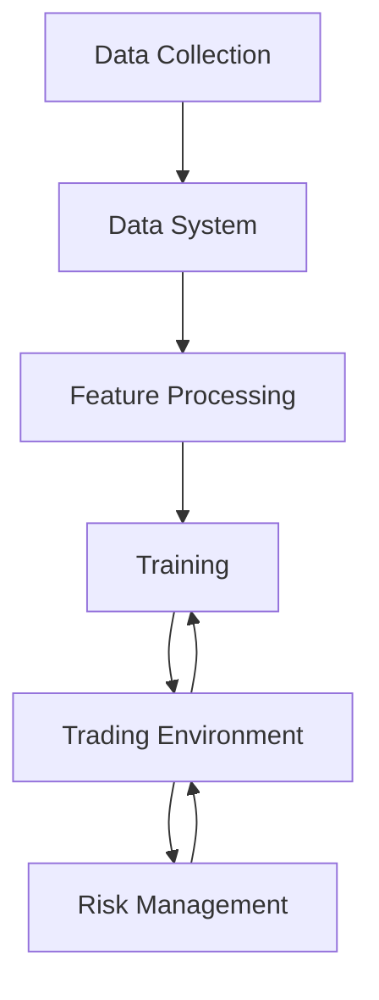

# Quantitative Trading System Workflow

## System Architecture Diagram



## 1. Data Collection Layer

The data collection layer is responsible for gathering multi-modal data from various sources:

- Market data (prices, volumes, order book)
- Sentiment data (social media, news)
- On-chain data (whale movements, network metrics)

Key components:

- `collect_multimodal.py`: Coordinates collection of data from different sources
- `whale_tracker.py`: Monitors large wallet movements and blockchain activity
- `test_apis.py`: Tests API connections and data validity

## 2. Data System Layer

The data system processes and manages the collected data:

### Data Management

- `data_manager.py`: Core data processing and storage
- `enhanced_data_manager.py`: Advanced data processing features
- `multimodal_feature_extractor.py`: Extracts features from different data types

### Feature Processing

- `feature_extractors.py`: Contains various feature extraction methods
  - Market features (price, volume, volatility)
  - Sentiment features (sentiment scores, social metrics)
  - On-chain features (network activity, whale movements)

## 3. Training Layer

The training system uses hierarchical reinforcement learning:

### Hierarchical PPO Implementation

- `hierarchical_ppo.py`: Implements hierarchical proximal policy optimization
  - High-level policy: Strategic decisions
  - Low-level policy: Tactical execution
  - Reward shaping based on PnL and risk metrics

## 4. Trading Environment

The institutional perpetual futures trading environment:

### Key Components (`institutional_perp_env.py`):

- Observation Space:

  ```python
  # Market, sentiment, onchain, and portfolio features
  self.observation_space = spaces.Box(
      low=-np.inf,
      high=np.inf,
      shape=(total_features,),
      dtype=np.float32
  )
  ```

- Action Space:
  ```python
  # Trade decisions (-1 to 1) and position sizes (0 to 1)
  self.action_space = spaces.Box(
      low=np.array([-1] * n_assets + [0] * n_assets),
      high=np.array([1] * n_assets + [1] * n_assets),
      dtype=np.float32
  )
  ```

### Key Methods:

1. Trade Execution:

```python
def _execute_trade(self, asset: str, trade_decision: float, position_size: float):
    # Calculates target position
    # Handles transaction costs
    # Updates positions and balance
```

2. Risk-Adjusted Rewards:

```python
def _calculate_risk_adjusted_reward(self, risk_metrics: Dict):
    # Incorporates multiple risk factors:
    # - Sharpe ratio
    # - Sortino ratio
    # - Calmar ratio
    # - Diversification score
    # - Leverage penalty
```

## 5. Risk Management Layer

Comprehensive risk management system:

### Risk Engine (`risk_engine.py`):

- Risk Limits:
  - Maximum drawdown
  - Leverage limits
  - VaR limits
  - Position concentration
  - Correlation limits
  - Liquidity ratios

### Key Risk Functions:

1. Portfolio Risk Calculation:

```python
def calculate_portfolio_risk(self, positions, market_data, portfolio_value):
    # Calculates VaR
    # Measures Expected Shortfall
    # Monitors position concentration
    # Tracks correlation risk
```

2. Liquidation Risk:

```python
def check_risk_limits(self, risk_metrics):
    # Verifies all risk limits
    # Returns violations if any
    # Triggers liquidation if necessary
```

## System Workflow

1. **Data Pipeline**:

   - Continuous data collection from multiple sources
   - Feature extraction and preprocessing
   - Data storage and management

2. **Training Process**:

   - Hierarchical PPO training with two policy levels
   - Risk-aware reward shaping
   - Continuous model updates based on performance

3. **Trading Execution**:

   - Environment state observation
   - Policy-based action selection
   - Smart order execution with transaction cost consideration
   - Real-time risk monitoring and management

4. **Risk Management**:
   - Continuous risk metric calculation
   - Limit monitoring and enforcement
   - Automated risk-based position adjustment
   - Liquidation protection

## Key Features

1. **Multi-modal Data Integration**:

   - Market data analysis
   - Sentiment incorporation
   - On-chain metrics utilization

2. **Advanced Risk Management**:

   - Real-time risk monitoring
   - Multiple risk metric tracking
   - Automated risk limit enforcement

3. **Smart Execution**:

   - Transaction cost optimization
   - Price impact consideration
   - Liquidity-aware trading

4. **Hierarchical Learning**:
   - Strategic high-level decisions
   - Tactical execution optimization
   - Risk-adjusted reward optimization
